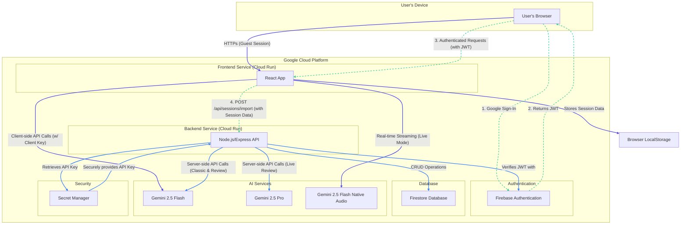

# AI Interview Coach

**AI Interview Coach** is a production-ready, full-stack web application that helps job seekers prepare for interviews with personalized, AI-generated questions and real-time conversational practice. **Users can try the full interview experience without an account**, and can optionally sign in with Google to save their session history and track their progress over time.

Powered by Google's Gemini models, a Node.js backend, and a Firestore database, it is designed for scalable deployment on Google Cloud Run and features secure user authentication via Firebase.


## Features

- **Frictionless Guest Access**: Try the complete "Classic" or "Live" interview experience instantly, with no signup required.
- **Optional & Secure User Accounts**: Sign up and log in with Google to save your interview history and track performance analytics across devices.
- **Two Distinct Practice Modes**:
    - **Classic Mode**: Answer pre-generated questions one-by-one via text or voice. Receive detailed, structured feedback on each answer.
    - **Live Mode**: Engage in a real-time, low-latency voice conversation with an AI interviewer that mimics a real video interview.
- **Deep Personalization**:
    - Upload your resume (`.txt`) to receive questions tailored specifically to your experience.
    - Choose from multiple AI interviewer personas (e.g., Friendly, Strict, HR Screener) to simulate different interview styles.
- **Comprehensive AI-Powered Feedback**:
    - **Classic Mode**: Get a score (1-10), strengths, areas for improvement, suggested answer structures, and key points missed for every question.
    - **Live Mode**: Receive a holistic review of the entire conversation, including feedback on non-verbal cues observed by the AI.
- **Performance Analytics Dashboard (for signed-in users)**:
    - Track your progress over time with a visual dashboard.
    - View your average score, score progression, and performance breakdown by question category.
- **Persistent & Secure**: A dedicated backend service securely manages API keys and stores all user-specific interview data in a central Firestore database for authenticated users.

## Tech Stack

- **Frontend**: React, TypeScript, Vite, Tailwind CSS
- **Backend**: Node.js, Express.js
- **Database**: Google Firestore
- **Authentication**: Firebase Authentication
- **AI/ML**: Google Gemini API
    - `gemini-2.5-flash` for fast question generation and answer evaluation.
    - `gemini-2.5-pro` for in-depth, holistic analysis of live interview transcripts.
    - `gemini-2.5-flash-native-audio-preview-09-2025` for real-time, bidirectional audio and video streaming.
- **Deployment**: Google Cloud Run (as two containerized services)
- **Utilities**: `lucide-react` for icons, `recharts` for charts.

## Architecture Diagram



## Getting Started (Local Development)

Follow these steps to run the full-stack application on your local machine.

### Prerequisites

- Node.js (v18 or later)
- pnpm
- A Google Cloud Project
- A Google Gemini API Key.
- [Google Cloud CLI](https://cloud.google.com/sdk/docs/install) authenticated (`gcloud auth application-default login`).

### Installation & Setup

1.  **Configure Your Google Cloud & Firebase Project:**
    - In your [Firebase Console](https://console.firebase.google.com/), select your Google Cloud project.
    - **Authentication:**
        - Navigate to **Authentication** -> **Sign-in method** and ensure the **Google** provider is enabled.
        - **Crucially, you must authorize your development domain.** Go to **Authentication** -> **Settings** -> **Authorized domains**. Click **Add domain** and enter `localhost`. This allows Google Sign-In to work from your local server.
    - **Firestore:**
        - Navigate to **Firestore Database** and create a database in Native mode.

2.  **Clone the repository and install dependencies:**
    ```bash
    git clone <your-repo-url>
    cd <repo-directory>
    pnpm install # Installs dependencies for both frontend and backend
    ```

3.  **Set up Backend environment:**
    Create a file named `backend/.env` and add your configuration:
    ```
    # Your Google Gemini API Key
    API_KEY="your_gemini_api_key_here"

    # Your Google Cloud Project ID
    GCLOUD_PROJECT="your-gcp-project-id"
    ```

4.  **Set up Frontend environment:**
    Create a file named `frontend/.env` and add your Firebase and backend configuration. You can find your Firebase config in your Firebase project settings under "Web app".
    ```
    # The URL for the backend API endpoint
    VITE_API_URL="http://localhost:8080/api"

    # Required for client-side Gemini calls (e.g., Live API for guests and users)
    VITE_API_KEY="your_gemini_api_key_here"

    # Firebase Client-side configuration
    VITE_FIREBASE_API_KEY="your_firebase_web_api_key"
    VITE_FIREBASE_AUTH_DOMAIN="your-project-id.firebaseapp.com"
    VITE_FIREBASE_PROJECT_ID="your-project-id"
    VITE_FIREBASE_STORAGE_BUCKET="your-project-id.appspot.com"
    VITE_FIREBASE_MESSAGING_SENDER_ID="your_sender_id"
    VITE_FIREBASE_APP_ID="your_app_id"
    ```

5.  **Run the development servers:**
    Open two terminal windows.
    - In terminal 1, run the **backend**:
      ```bash
      pnpm --filter backend start
      ```
    - In terminal 2, run the **frontend**:
      ```bash
      pnpm --filter frontend start
      ```
    The application will be available at `http://localhost:3000` (or your Vite dev server port).

## Deployment to Google Cloud Run

Deploying this application involves creating two separate Cloud Run services: one for the backend and one for the frontend.

### 1. Backend Deployment

The backend service holds the API keys and connects to Firestore. It must be deployed first.

1.  **Build and submit the container image:**
    From the project root directory, run:
    ```bash
    gcloud builds submit --pack image=gcr.io/[PROJECT_ID]/ai-coach-backend --source=backend
    ```

2.  **Deploy to Cloud Run:**
    Deploy the image, passing your Gemini API key as a secret.
    - First, create the secret:
    ```bash
    echo -n "your_gemini_api_key_here" | gcloud secrets create gemini-api-key --data-file=-
    ```
    - Then, deploy the service. **Crucially, you must assign a service account that has the "Firebase Authentication Admin" and "Cloud Datastore User" roles.**
    ```bash
    gcloud run deploy ai-coach-backend \
      --image gcr.io/[PROJECT_ID]/ai-coach-backend \
      --platform managed \
      --region [YOUR_REGION] \
      --allow-unauthenticated \
      --set-secrets="API_KEY=gemini-api-key:latest" \
      --service-account [YOUR_SERVICE_ACCOUNT_EMAIL]
    ```
    Take note of the backend service URL after deployment.

### 2. Frontend Deployment

The frontend needs to know the URL of the deployed backend and have the Firebase configuration.

1.  **Build and submit the container image:**
    This step requires passing the backend API URL, the client-side Gemini key, and all Firebase config values as build arguments. This command should be run from the project root.
    ```bash
    gcloud builds submit \
      --tag gcr.io/[PROJECT_ID]/ai-coach-frontend \
      --source=frontend \
      --build-arg="VITE_API_URL=[YOUR_BACKEND_URL_FROM_PREVIOUS_STEP]/api" \
      --build-arg="VITE_API_KEY=[YOUR_GEMINI_API_KEY]" \
      --build-arg="VITE_FIREBASE_API_KEY=[YOUR_FIREBASE_WEB_API_KEY]" \
      --build-arg="VITE_FIREBASE_AUTH_DOMAIN=[...]" \
      --build-arg="VITE_FIREBASE_PROJECT_ID=[...]" \
      --build-arg="VITE_FIREBASE_STORAGE_BUCKET=[...]" \
      --build-arg="VITE_FIREBASE_MESSAGING_SENDER_ID=[...]" \
      --build-arg="VITE_FIREBASE_APP_ID=[...]"
    ```

2.  **Deploy to Cloud Run:**
    ```bash
    gcloud run deploy ai-coach-frontend \
      --image gcr.io/[PROJECT_ID]/ai-coach-frontend \
      --platform managed \
      --region [YOUR_REGION] \
      --allow-unauthenticated
    ```
This will give you the public URL to access your application.